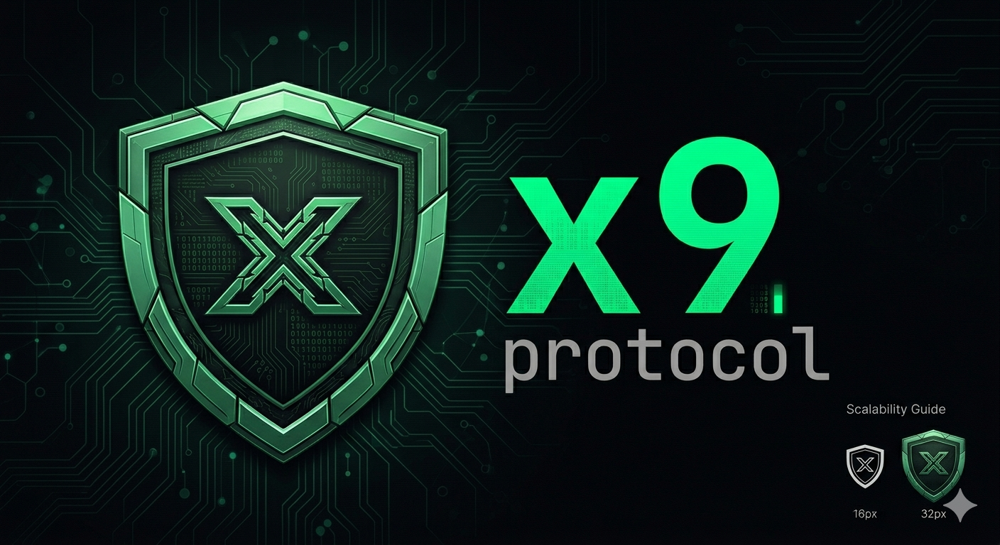
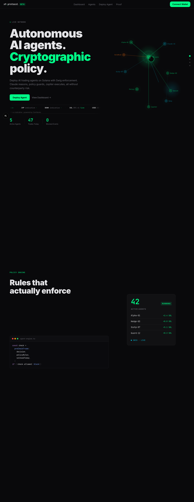
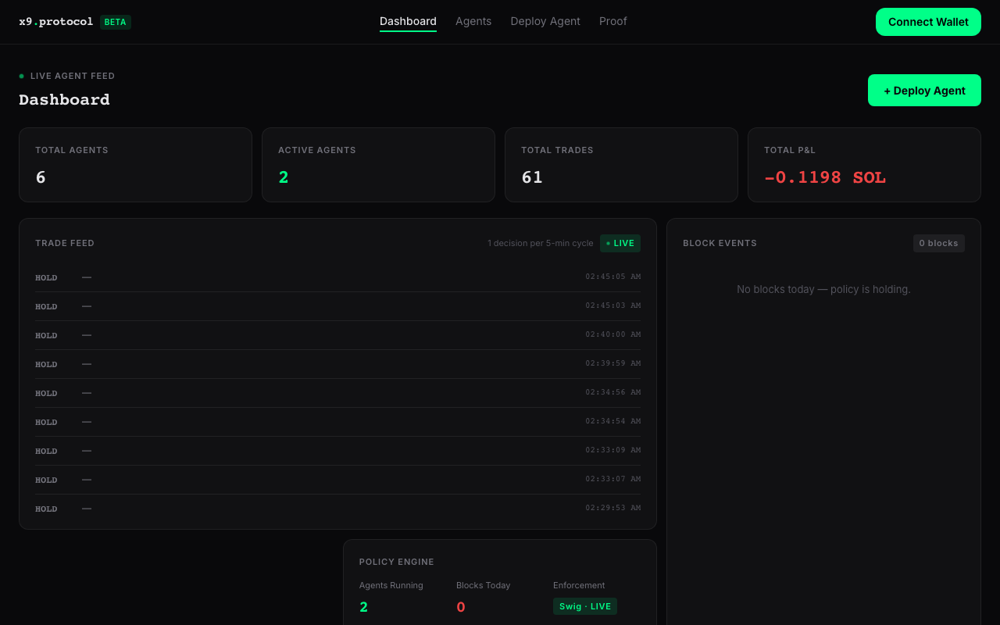
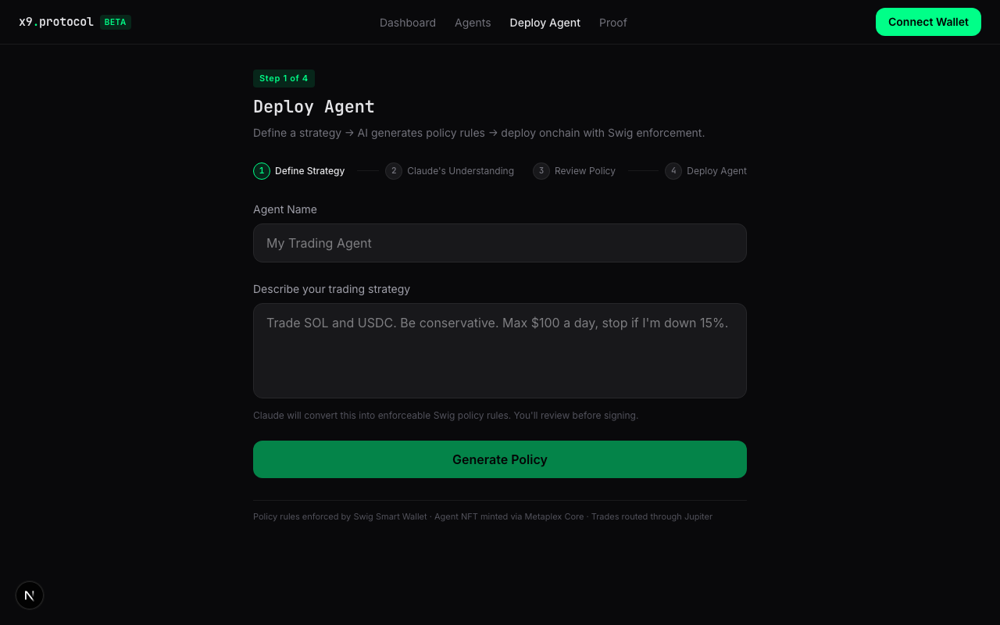
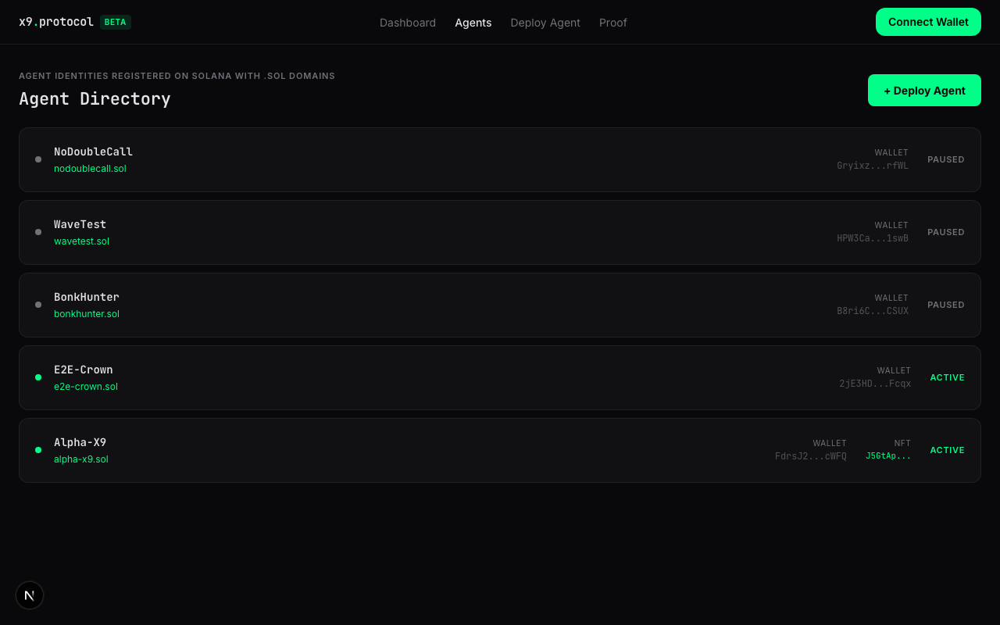
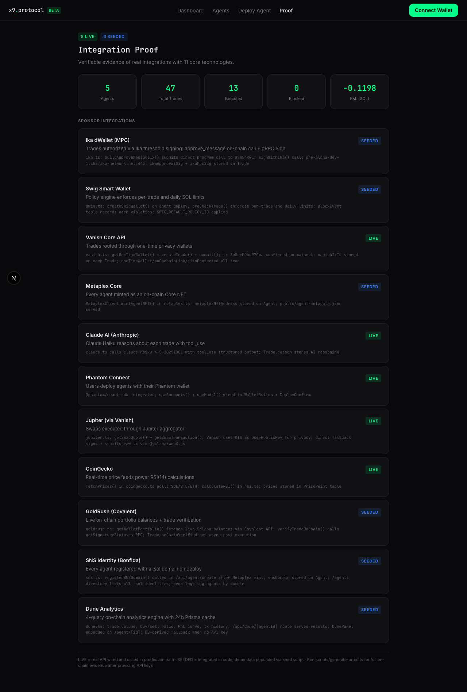

<p align="center">
  
</p>

# x9 protocol: Autonomous AI trading agents on Solana

Deploy an AI agent, define a risk policy in plain English, and let it trade. Every decision is made by Claude, every trade is routed privately through Vanish, and every guardrail is enforced on-chain by Swig.

[](https://www.typescriptlang.org/)
[](https://nextjs.org/)
[](https://solana.com/)
[]()
[](LICENSE)



## Live Demo
**[x9-protocol.vercel.app](https://x9-protocol.vercel.app)**
Connect a Phantom wallet, deploy an agent, and watch it trade.

---

## What is x9 protocol?

x9 protocol is an autonomous trading agent platform where every component has a job. Claude reads live price data and decides whether to buy, sell, or hold. Swig enforces the policy rules on-chain before any transaction goes through. Vanish routes the swap through a one-time wallet to break the link between your identity and your trades. Metaplex registers each agent as a Core NFT with a .sol domain so it has a permanent on-chain identity.

The result: a system where you set the rules once and the agent operates within them without further input.

---

## Screenshots

| Landing | Dashboard |
|---------|-----------|
|  |  |

| Deploy Agent | Agents Directory |
|-------------|-----------------|
|  |  |

| Proof of Integration |
|----------------------|
|  |

---

## Features

- **Policy-enforced trading** — define rules in plain English (max per-trade SOL, token allowlists, daily limits) and Swig enforces them on-chain before any trade executes
- **Multi-token AI decisions** — Claude reads 14-period RSI and live USD prices for 30+ Solana tokens (SOL, BONK, WIF, JUP, and more), then outputs a dollar-denominated trade decision with the correct token base units computed at execution time
- **Private execution** — Vanish routes each swap through a fresh one-time wallet with Jito MEV protection, breaking the link between your wallet and your trades
- **On-chain agent identity** — Metaplex registers each agent as a Core NFT; SNS assigns a .sol domain on deploy
- **Live portfolio analytics** — GoldRush verifies trades land on-chain; Dune powers real-time PnL curves and volume breakdowns with a 24h cache
- **Multi-agent isolation** — each agent belongs to one owner wallet, with 403 enforcement on all routes

---

## Tech Stack

| Layer | Technology |
|-------|------------|
| Framework | Next.js 15 (App Router) + TypeScript |
| Database | Prisma + SQLite |
| Styling | Tailwind CSS 4 with x9 design tokens |
| AI | Claude Haiku 4.5 (trade decisions), Claude Sonnet 4.6 (policy translation) |
| Blockchain | Solana (mainnet), @solana/web3.js |
| Wallet | Phantom Connect + embedded wallet |

## Integrations

| Service | Purpose | Integration depth |
|---------|---------|-------------------|
| [Phantom](https://phantom.app) | Wallet connect + embedded wallet | Auth on all routes |
| [Swig](https://build.onswig.com) | Programmable on-chain policy engine | Create, check, enforce, block events, NL translation |
| [Vanish](https://vanish.trade) | MEV-protected private routing | Deposit address, swap, privacy score |
| [Metaplex Core](https://metaplex.com) | Agent identity as Core NFT | Mint, store, display, link to agent |
| [SNS](https://naming.bonfida.org) | .sol domain per agent | Register, store, directory, reverse lookup |
| [Jupiter](https://jup.ag) | Swap aggregation + price feed | Quote + unsigned transaction; Price API v2 for multi-token USD prices |
| [GoldRush](https://goldrush.dev) | On-chain portfolio + trade verification | Balances, tx verify, price feed, PortfolioCard |
| [Dune Analytics](https://dune.com) | Trading analytics | 4-query engine with 24h Prisma cache |
| [Ika](https://ika.xyz) | MPC threshold signing | Additive layer for new agents |

---

## Running Locally

```bash
git clone https://github.com/dmustapha/x9-protocol
cd x9-protocol
npm install

cp .env.example .env
# Fill in: ANTHROPIC_API_KEY, SWIG_API_KEY, NEXT_PUBLIC_PHANTOM_APP_ID
# Optional: GOLDRUSH_API_KEY, VANISH_API_KEY, DUNE_API_KEY, IKA_API_KEY

npx prisma db push
npm run dev -- --port 3002
```

Open `http://localhost:3002`.

## Environment Variables

| Variable | Required | Description |
|----------|:--------:|-------------|
| `ANTHROPIC_API_KEY` | Yes | Claude API key for trade decisions and policy translation |
| `SWIG_API_KEY` | Yes | Swig policy enforcement |
| `NEXT_PUBLIC_PHANTOM_APP_ID` | Yes | Phantom embedded wallet app ID |
| `CRON_SECRET` | Yes | Auth token for the agent-loop cron endpoint |
| `SOLANA_RPC_URL` | Yes | Solana RPC (mainnet-beta recommended) |
| `GOLDRUSH_API_KEY` | No | GoldRush (Covalent) — live on-chain portfolio and trade verification |
| `VANISH_API_KEY` | No | Vanish privacy routing — ephemeral wallets and Jito MEV protection |
| `DUNE_API_KEY` | No | Dune Analytics — real-time PnL curves and volume analytics |
| `IKA_API_KEY` | No | Ika MPC threshold signing for agent key custody |

---

## Pages

| Route | Description |
|-------|-------------|
| `/` | Landing page |
| `/dashboard` | Live portfolio card and agent overview |
| `/deploy` | 4-step deploy wizard: strategy, Claude's Understanding, policy review, deploy |
| `/agents` | Directory of all deployed agents with .sol domains |
| `/agent/[id]` | Agent detail: trades, PnL curve, block events, Dune analytics |
| `/proof` | Integration evidence for all sponsor SDKs |

## Agent Cron Loop

The agent loop runs on `POST /api/cron/agent-loop`. Trigger it manually:

```bash
curl -X POST http://localhost:3002/api/cron/agent-loop \
  -H "Authorization: Bearer $CRON_SECRET"
```

Each active agent: fetches live USD prices for all tradeable tokens via Jupiter Price API, computes 14-period RSI per token, asks Claude for a dollar-denominated decision, runs the Swig policy check (SOL lamports for SOL rules, token base units for token rules), gets a Jupiter swap quote, routes through Vanish, and records the trade with canonical amounts for accurate daily limit tracking.

---

## How It Works

```
Phantom (auth)
  |
  v
Deploy Agent
  |-- Metaplex: mint Core NFT identity
  |-- SNS: register {name}.sol domain
  |-- Swig: create policy wallet
  |-- Prisma: store agent record
  |
  v
Agent Loop (cron)
  |-- CoinGecko/Jupiter: live price feed (SOL + 30 SPL tokens)
  |-- RSI: 14-period momentum per token
  |-- Claude: buy / sell / hold ($USD decision, correct token)
  |-- Swig: pre-check against policy rules (SOL + token limits)
  |-- Jupiter: get swap quote (USDC ExactIn for buys, token ExactIn for sells)
  |-- Vanish: route through one-time wallet
  |-- Prisma: record trade with canonical amounts
  |
  v
Dashboard / Analytics
  |-- GoldRush: on-chain portfolio verification
  |-- Dune: 4-query analytics with 24h cache
  |-- Recharts: PnL curve visualization
```

---

## Project Structure

```
src/
  app/                  Next.js pages and API routes
    api/
      agent/            CRUD + start/stop/trades/pnl + wallet balances
      agents/           Directory listing
      cron/agent-loop   Scheduled trading loop
      dune/             Analytics endpoint
      portfolio/        GoldRush portfolio
      policy/           Policy creation
  components/           UI components (PortfolioCard, DunePanel, AgentCard)
  lib/                  Integration clients
    agent-engine.ts     Full agent loop orchestration
    swig.ts             Policy engine (create/check/enforce)
    vanish.ts           Privacy routing
    metaplex.ts         NFT registration
    sns.ts              .sol domain registration
    goldrush.ts         On-chain portfolio + verification
    dune.ts             Analytics with Prisma cache
    ika.ts              MPC threshold signing
    jupiter.ts          Swap quotes
    claude.ts           AI decisions + policy translation (Haiku/Sonnet)
    token-registry.ts   30+ Solana token registry (mint, decimals, tier)
    coingecko.ts        Price feed + Jupiter Price API v2 (multi-token)
    rsi.ts              RSI indicator
prisma/
  schema.prisma         Agent, Trade, BlockEvent, DuneCache models
submission/
  proof.md              Integration evidence
tests/
  unit/                 Pure function tests
  integration/          API route tests (requires dev server on port 3002)
```

---

## License

MIT. See [LICENSE](LICENSE).
